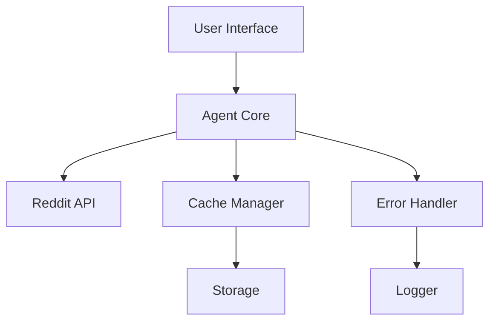

# System Patterns

## Architecture Overview
The system follows a modular architecture with two main agent implementations sharing common patterns but differing in their approach to content management and caching.

## Key Technical Decisions
1. **Agent Implementation**:
   - Using Google ADK as the foundation
   - Separate implementations for basic and enhanced features
   - Modular design allowing for easy extension

2. **Content Management**:
   - Basic version: Direct API calls to Reddit
   - MCP version: Cached content with configurable TTL
   - Compression support for cache optimization

3. **Interface Design**:
   - Streamlit-based web interface
   - Chat-style interaction model
   - Mobile-responsive design

## Design Patterns in Use
1. **Agent Pattern**:
   - Clear separation of concerns
   - Modular component design
   - Extensible architecture

2. **Caching Pattern (MCP)**:
   - Configurable cache parameters
   - TTL-based expiration
   - Size-based eviction
   - Compression support

3. **Error Handling**:
   - Graceful degradation
   - Comprehensive logging
   - User-friendly error messages

## Component Relationships


## Data Flow
1. **Basic Agent**:
   ```
   User Request -> Agent -> Reddit API -> Response Processing -> User
   ```

2. **MCP Agent**:
   ```
   User Request -> Agent -> Cache Check -> [Cache Hit -> Response]
                                      -> [Cache Miss -> Reddit API -> Cache Update -> Response]
   ```

## Configuration Management
1. Environment-based configuration
2. Separate config for development/production
3. API key management
4. Cache parameter configuration

## Testing Strategy
1. Unit tests for core components
2. Integration tests for API interactions
3. Performance comparison tests
4. Cache behavior validation 